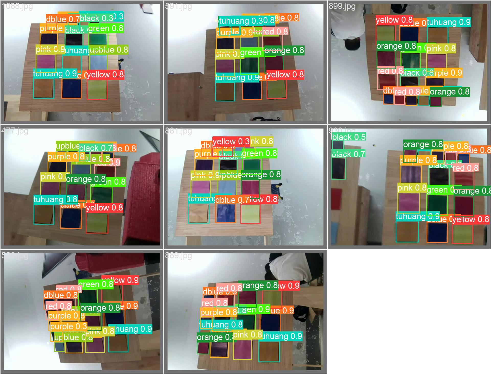


**2024 RM校内赛视觉开源**
=

### **Team: 天河客运站<br>**

#### **Author: *视觉 崔宇***

## 背景介绍:

2024华工机器人校内赛 
基于Yolov5的视觉识别方案
>附：训练代码，模型及主程序代码

**```注意```**

+ 由于笔者c++水平有限，本项目基于Python开发，实践证明Python以足够满足校内赛的需求，若读者精益求精，可尝试yolov5模型在c++上的部署。

##  主要思路
1、 通过yolo识别获得14个对应色块的box，后处理得到14个色块中心在img中的像素点
2、将y轴最小的五个色块（即上方小色块）取出，按从右往左的顺序依次得到对应顺序
3、在下方9个色块中取出对应色块安顺序排好的坐标，色块识别部分结束。
4、降低曝光并使用hsv识别激光位置，获得激光像素点在图像上与对应色块中心坐标的差值，将差值✖权重输出较小角度，再通过视觉闭环不断移动激光，差值小于一定像素点阈值后即判定到达
>由于识别版较小，通过调参可以将每个色块间的移动降低到两次以下，甚至一次完成，降低在其他色块间停留两秒以上的风险

5、循环以上，直至最后一次完成。

### 效果展示



>若无法查看，请查阅主目录
- 在校赛过程中，成功识别的概率超过90%，但由于串口通信的原因，真正完赛的次数仅有两次。
### 环境配置
| 环境配置 |
| - | 
| Yolo环境 | 
| python-opencv |
| pyserial | 

### 目录说明
| 文件名 | 用途 |
| - | -|
| train_yolov5| yolo的训练代码、数据集和模型|
| use_code |主程序代码|
| utils |一些提高效率的工具|
+ 具体的部分说明文档请查看对应文件夹内的README

### 食用方法
- 配置好所需环境后，在该环境下运行use_code文件中的main.py即可
**```注意```**
+ 不同电脑对应的串口号和摄像头id不同，请根据自身情况调整，不同摄像头的曝光系数和对不同激光的hsv色域也需调整

### 拓展 
+ 本项目是基于视觉闭环的yolo识别，如果想基于yolo找角点pnp解算开环一步到位，可以考虑上交的四点模型，通过修改yolo的检测头使其回归目标色块的四个角点。

## 致谢
+ 感谢华南虎及机协为我们提供平台和展示机会，祝校内赛越办越好！

